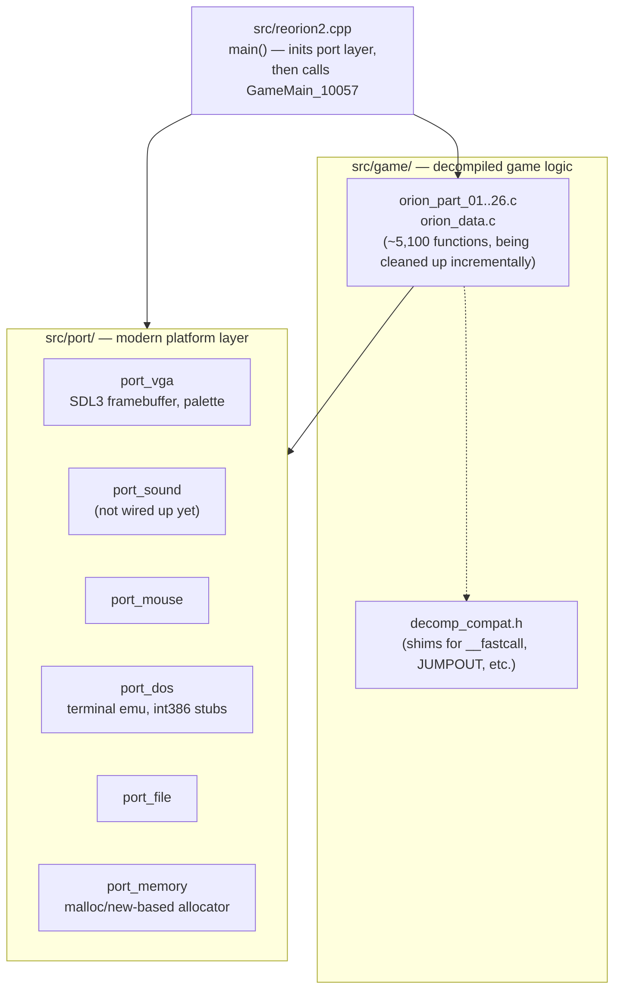

# reorion2

A from-scratch, functionally faithful **native Windows port of Master of Orion II** (MicroProse / SimTex, 1996), rebuilt from a decompilation of the original DOS binary into readable modern C++ / SDL3.

> **Status: work in progress — not playable yet.** The engine boots, initializes its subsystems, and now runs deep into game start-up (menus, text/font rendering, resource loading), but still hits crashes and hangs before the main game loop is reachable. See [Current status](#current-status) below.

## What this is

`Orion2.exe` was decompiled into ~5,100 functions across ~300,000 lines of low-level, DOS-real-mode-flavored C (`sub_XXXXXX` names, raw segment math, `int`-as-pointer tricks, BIOS/DOS interrupt calls). This project incrementally turns that dump into a real, compilable, cross-platform-minded engine:

- BIOS/DOS/VGA/mouse/sound dependencies are extracted into a small `src/port/` layer (inspired by [DOSBox-X](https://github.com/joncampbell123/dosbox-x) and the `remc2` project), built on **SDL3**.
- Memory management moves off segment:offset DOS tricks onto `malloc`/`new`.
- Decompiler artifacts (`JUMPOUT`, `__usercall`, fused/lost register arguments, "possibly undefined" locals, mis-sized buffers) are identified, verified against the original disassembly, and fixed function by function.
- Where an `int` turns out to actually be a pointer, it gets a real type — and a real `struct` when the layout is clear.

The goal is a modern, readable, maintainable codebase that plays identically to the original — not a rewrite, a **faithful, verified translation**.

## Current status

_Last updated: 2026-07-24_

| Platform | Builds | Runs to |
|---|---|---|
| x86 (Win32) | ✅ | Main menu entry (crashes shortly after, see below) |
| x64 | ✅ | Main menu entry (crashes shortly after — same fixes apply to both) |

Recent milestones (see [`PROGRESS.md`](PROGRESS.md) for the full, wave-by-wave engineering log):

- The DOS-era intro-video / logo cinematics play through their animation loops correctly.
- Font/text rendering, the tech-tree init tables, and localized string tables no longer crash.
- A cluster of **x64-only** bugs was found and fixed: a register-fusion trick that only works when a pointer fits in 32 bits (it doesn't on x64), a couple of "the decompiler mistook this integer constant for a function address" false positives, and a parser context pointer that silently truncated 64-bit stack addresses.
- Known open issues right now: the intro sequence can get stuck right at the very end (loading the main intro cinematic data — under investigation), and there's a new crash just past the main-menu entry point.

Nothing is playable yet — there's no in-game screenshot to show, because the game doesn't survive long enough to reach one. That will change as the crash frontier keeps moving forward; this section (and the changelog below) gets updated as it does.

## Architecture



```
reorion2/
  src/
    reorion2.cpp          # entry point: inits the port layer, then calls GameMain_10057
    game/                 # the decompiled game itself, being incrementally cleaned up
      orion_part_01.c ... orion_part_26.c
      orion_data.c         # global data/tables extracted from the original binary
      decomp_compat.h        # compatibility shims for decompiler artifacts
      orion_common.h        # shared declarations
    port/                 # modern platform layer replacing BIOS/DOS/VGA/mouse/sound
      port_vga.*    port_sound.*   port_mouse.*
      port_dos.*    port_file.*    port_memory.*
  Debug/, x64/Debug/      # build output + game data files (LBX archives) live here
  ref/                    # reference material pulled from the original disassembly
  PROGRESS.md             # detailed, chronological engineering log ("waves")
  prompt.md               # the porting methodology/rules this project follows
```

## Building

Requires Visual Studio 2022 (MSBuild) and the original game's data files (LBX archives) — this repository does not include or distribute them; you need a legally owned copy of Master of Orion II.

```bash
# x86 (Win32)
MSBuild reorion2.sln -p:Configuration=Debug -p:Platform=x86

# x64
MSBuild reorion2.sln -p:Configuration=Debug -p:Platform=x64
```

The game's data files (`*.LBX` and friends) need to sit next to the built executable — `Debug\` for x86, `x64\Debug\` for x64.

```bash
cd Debug && ./reorion2.exe            # x86
cd x64/Debug && ./reorion2.exe        # x64
```

Useful environment variables while debugging:

- `REORION2_TRACE=1` — print diagnostic checkpoints to stderr as the game boots.
- `REORION2_SKIPINTRO=1` — skip the intro cinematics and jump straight to menu init (faster iteration while bisecting crashes).

## Porting methodology

This project follows a deliberate, verify-before-you-fix process (full rules in [`prompt.md`](prompt.md)):

1. Convert decompiled functions to readable code incrementally, one call graph at a time, starting from `GameMain_10057` (originally `main__0`).
2. Extract real `struct`s instead of raw offset casts (`*(int*)(a1+34)`) wherever the layout is clear.
3. When an `int` turns out to be a pointer, retype it — and pull out a struct once the shape is known.
4. Remove `JUMPOUT`/`goto` artifacts where possible, without changing behavior.
5. Route anything BIOS/DOS/hardware-shaped into `src/port/*.cpp`.
6. Strip decompiler calling-convention noise (`__fastcall`, `__usercall`, ...) once it's confirmed dead.
7. **Always cross-check against the original disassembly** (`Debug/diss/Orion2.exe.asm`) when decompiled control flow, argument counts, or return values look suspicious — the decompiler gets things wrong often enough that "looks weird" is a real signal, not noise.
8. English for all comments and all `.md` documentation.

## Contributing / history

Development log with full technical detail (root causes, asm cross-references, before/after) lives in [`PROGRESS.md`](PROGRESS.md). It's organized into numbered "waves," each one a focused investigation-and-fix session.

## Legal

This repository contains **no original game assets or data files**. It is a clean-room-adjacent engineering exercise built from a decompilation of the executable's *code*, intended for use only with a legally owned copy of Master of Orion II. Master of Orion II is a trademark of its respective rights holders; this is an unofficial, non-commercial fan project.
