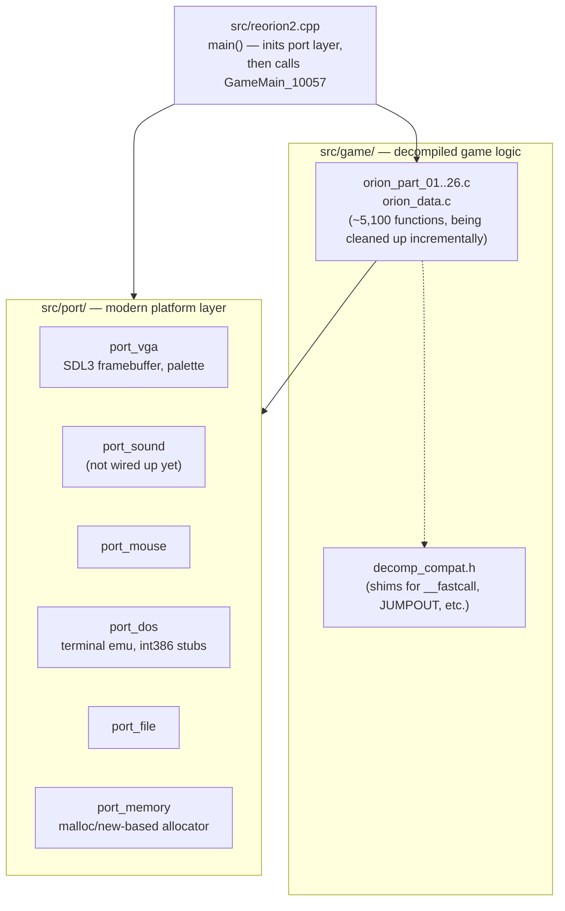

# reorion2

A from-scratch, functionally faithful **native Windows port of Master of Orion II** (MicroProse / SimTex, 1996), rebuilt from a decompilation of the original DOS binary into readable modern C++ / SDL3.

> **Status: work in progress.** The engine boots through the intro and menus, starts a game, and renders the main in-game screens — five of the six of them within 0.15 % of the original, pixel for pixel. Gameplay beyond rendering (turns, combat, diplomacy) is not verified yet. See [Current status](#current-status) below.

## What this is

`Orion2.exe` was decompiled into ~5,100 functions across ~300,000 lines of low-level, DOS-real-mode-flavored C (`sub_XXXXXX` names, raw segment math, `int`-as-pointer tricks, BIOS/DOS interrupt calls). This project incrementally turns that dump into a real, compilable, cross-platform-minded engine:

- BIOS/DOS/VGA/mouse/sound dependencies are extracted into a small `src/port/` layer (inspired by [DOSBox-X](https://github.com/joncampbell123/dosbox-x) and the `remc2` project), built on **SDL3**.
- Memory management moves off segment:offset DOS tricks onto `malloc`/`new`.
- Decompiler artifacts (`JUMPOUT`, `__usercall`, fused/lost register arguments, "possibly undefined" locals, mis-sized buffers) are identified, verified against the original disassembly, and fixed function by function.
- Where an `int` turns out to actually be a pointer, it gets a real type — and a real `struct` when the layout is clear.

The goal is a modern, readable, maintainable codebase that plays identically to the original — not a rewrite, a **faithful, verified translation**.

## Current status

_Last updated: 2026-08-29_

The port is compared against the original running under DOSBox-X, frame by frame,
from the same starting position. Each in-game screen is measured as "how many of
the 307,200 pixels differ":

| Screen | Differing pixels | |
|---|---:|---|
| RACES | **0** | 0.00 % — pixel-identical |
| PLANETS | 8 | 0.00 % |
| FLEETS | 266 | 0.09 % |
| INFO | 321 | 0.10 % |
| COLONIES | 459 | 0.15 % |
| LEADERS | 6,459 | 2.10 % — system view still missing |

A 600-frame regression harness (`compare_frames`) runs the boot sequence against
recorded DOSBox-X output and currently reports 600/600 identical frames; it has to
stay green for any change to be accepted.

Day-to-day work happens on the **x64 Debug** build, which is what the numbers above
were measured on. x86 still builds, but has not been re-verified against the harness
recently — the fixes are platform-independent, the verification effort simply goes
into one configuration.

Recent milestones (see [`PROGRESS.md`](PROGRESS.md) for the full, wave-by-wave engineering log):

- The intro, menus and game start-up run through; the in-game screens render.
- Several recurring classes of decompiler damage were identified and are now hunted
  systematically rather than one at a time:
  - **Truncated tables** — a contiguous array in the binary split into a one-element
    symbol plus "the rest", so `table[2*i]` read out of bounds.
  - **Overlapping views** — one record table exposed as several symbols at different
    offsets, all but one of them one element long. Spotted by the *stride* in the
    code: `dword[3*i]`, `word[6*i]`, `byte[12*i]` all mean the same 12-byte record.
  - **Empty thunks** — `push <flag> / jmp <shared body>` decompiled to `JUMPOUT`,
    which is a no-op in the port, so the function silently did nothing.
  - **Dropped return values and lost register arguments** — the Watcom register
    calling convention (`eax/edx/ebx/ecx`) is invisible to the decompiler, so calls
    lost arguments and callers read uninitialized locals instead of results.
  - **The same address under two names** — a stub in `link_stubs.c` and real data in
    `orion_data.c` became two separate objects: one got filled, the other got read.
- Tooling added alongside the fixes, under `tools/compare/`: byte-level reads from the
  original image (`dumpdata.py`), best-frame matching between port and DOSBox
  (`bestmatch.py`), and scanners for the two aliasing/sizing bug classes
  (`scan_alias.py`, `scan_velikosti.py`). The port itself grew a hardware watchpoint
  (`PortDebug_WatchWrite`, x86 debug registers) that names the exact instruction
  corrupting a global — it found a memory-overwrite bug on the first attempt.
- Known open issues right now: the LEADERS screen draws the correct star system's name
  and map position but leaves the system view itself empty, and a family of string
  helpers (`sub_24ACA` and its thunks) that substitutes numbers into text from the
  game's string archives is still unimplemented, so a few numbers are missing from
  otherwise correct labels.

## Screenshots

Progress screenshots live on the [`wiki`](https://github.com/turican0/reorion2/tree/wiki/screenshots) branch (kept separate so binary images don't bloat `main`'s history).

**2026-08-29 — in-game screens render 1:1 with the original.** Port on the left, original under DOSBox-X on the right, same starting position:


459 of 307,200 pixels differ (0.15 %) — a single 17×27 rectangle, the scrollbar
thumb, which the original still shades and the port does not.

**2026-08-29 — RACES, from the port alone:**


This one is pixel-identical to the original, so a side-by-side would just be the
same image twice.

**2026-07-24 — intro cinematics render correctly:**


The SimTex logo (first frame of the intro sequence) drawing correctly on real hardware/window — confirms the font/palette/framebuffer fixes from this wave are visually correct, not just crash-free.

## Architecture


```mermaid
flowchart TB
    subgraph decompiled["src/game/ — decompiled game logic"]
        orion["orion_part_01..26.c\norion_data.c\n(~5,100 functions, being cleaned up incrementally)"]
        compat["decomp_compat.h\n(shims for __fastcall, JUMPOUT, etc.)"]
    end

    subgraph port["src/port/ — modern platform layer"]
        vga["port_vga\nSDL3 framebuffer, palette"]
        sound["port_sound\n(not wired up yet)"]
        mouse["port_mouse"]
        dos["port_dos\nterminal emu, int386 stubs"]
        file["port_file"]
        mem["port_memory\nmalloc/new-based allocator"]
    end

    entry["src/reorion2.cpp\nmain() — inits port layer,\nthen calls GameMain_10057"]

    entry --> port
    entry --> orion
    orion --> port
    orion -.-> compat
```

```
reorion2/
  src/
    reorion2.cpp          # entry point: inits the port layer, then calls GameMain_10057
    game/                 # the decompiled game itself, being incrementally cleaned up
      orion_part_01.c ... orion_part_26.c
      orion_data.c         # global data/tables extracted from the original binary
      decomp_compat.h        # compatibility shims for decompiler artifacts
      orion_common.h        # shared declarations
    port/                 # modern platform layer replacing BIOS/DOS/VGA/mouse/sound
      port_vga.*    port_sound.*   port_mouse.*
      port_dos.*    port_file.*    port_memory.*
  Debug/, x64/Debug/      # build output + game data files (LBX archives) live here
  ref/                    # reference material pulled from the original disassembly
  PROGRESS.md             # detailed, chronological engineering log ("waves")
  prompt.md               # the porting methodology/rules this project follows
```

## Building

Requires Visual Studio 2022 (MSBuild) and the original game's data files (LBX archives) — this repository does not include or distribute them; you need a legally owned copy of Master of Orion II.

```bash
# x86 (Win32)
MSBuild reorion2.sln -p:Configuration=Debug -p:Platform=x86

# x64
MSBuild reorion2.sln -p:Configuration=Debug -p:Platform=x64
```

The game's data files (`*.LBX` and friends) need to sit next to the built executable — `Debug\` for x86, `x64\Debug\` for x64.

```bash
cd Debug && ./reorion2.exe            # x86
cd x64/Debug && ./reorion2.exe        # x64
```

Useful environment variables while debugging:

- `REORION2_TRACE=1` — print diagnostic checkpoints to stderr as the game boots.
- `REORION2_SKIPINTRO=1` — skip the intro cinematics and jump straight to menu init (faster iteration while bisecting crashes).
- `REORION2_SENDKEY=<code>:<ms>` and `REORION2_CLICK="x,y@ms:hold;..."` — scripted input, so a run can drive itself to a specific screen unattended.
- `REORION2_DUMP_DIR=<dir>` with `REORION2_DUMP_AFTER_MS` / `REORION2_DUMP_FRAME_RANGE` — dump raw framebuffers (palette + 640×480 indices) for comparison against DOSBox-X.
- `REORION2_WATCHDOG=<seconds>` — if no frame is presented for that long, suspend the main thread and print its stack. Turns "the window stopped responding" into a call stack.
- `REORION2_PROBE_LOG=1` with `REORION2_PROBE_AFTER_MS` — buffered, timestamped log for temporary probes placed in game code (`PortDebug_ProbeLog`). The threshold matters: drawing functions are called tens of thousands of times before the interesting screen is reached.

## Porting methodology

This project follows a deliberate, verify-before-you-fix process (full rules in [`prompt.md`](prompt.md)):

1. Convert decompiled functions to readable code incrementally, one call graph at a time, starting from `GameMain_10057` (originally `main__0`).
2. Extract real `struct`s instead of raw offset casts (`*(int*)(a1+34)`) wherever the layout is clear.
3. When an `int` turns out to be a pointer, retype it — and pull out a struct once the shape is known.
4. Remove `JUMPOUT`/`goto` artifacts where possible, without changing behavior.
5. Route anything BIOS/DOS/hardware-shaped into `src/port/*.cpp`.
6. Strip decompiler calling-convention noise (`__fastcall`, `__usercall`, ...) once it's confirmed dead.
7. **Always cross-check against the original disassembly** (`Debug/diss/Orion2.exe.asm`) when decompiled control flow, argument counts, or return values look suspicious — the decompiler gets things wrong often enough that "looks weird" is a real signal, not noise.
8. English for all comments and all `.md` documentation.

## Contributing / history

Development log with full technical detail (root causes, asm cross-references, before/after) lives in [`PROGRESS.md`](PROGRESS.md). It's organized into numbered "waves," each one a focused investigation-and-fix session.

## Legal

This repository contains **no original game assets or data files**. It is a clean-room-adjacent engineering exercise built from a decompilation of the executable's *code*, intended for use only with a legally owned copy of Master of Orion II. Master of Orion II is a trademark of its respective rights holders; this is an unofficial, non-commercial fan project.
